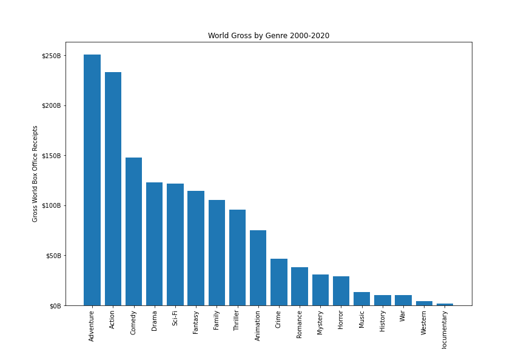
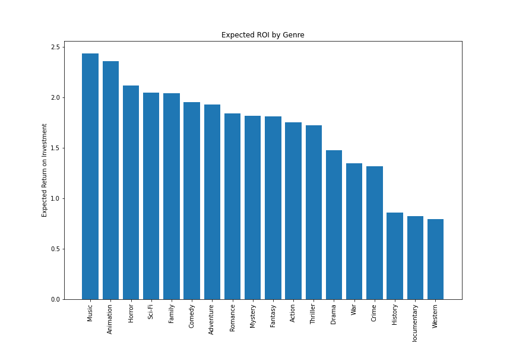
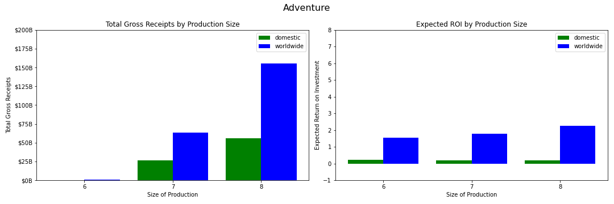
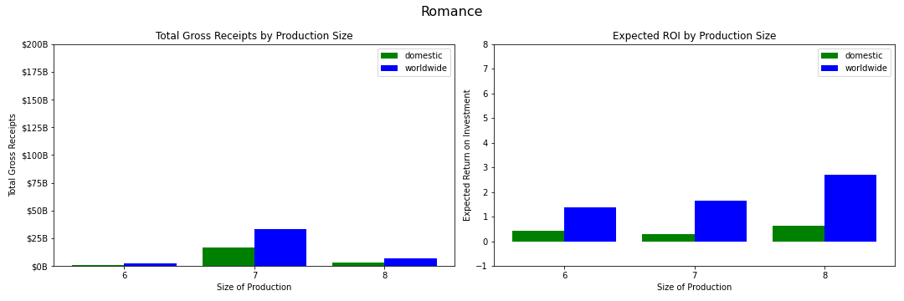
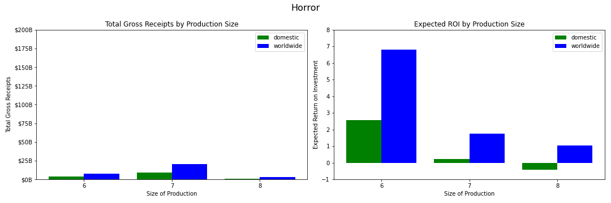

# How Should a Film Studio Invest Its Capital?

## Questions

While it's easy to be mesmerized by individual box office statistics, a rational approach to investment in film production requires looking at profits over the entire industry. While we might know that a single MCU movie made for hundreds of millions of dollars can make over a billion dollars worldwide, this doesn't tell us how profitable investment in nine budget action films is overall. Does more money invested in these movies lead to higher profits or is it a better strategy to trim down production costs even if it means fewer ticket sales? Are there other genres that may have a smaller market share but are nevertheless good opportunities for investment? To answer these question, we need estimates of two parameters: 

1. The market size of various film genres
2. Their expected returns on investment.

I define the market size of a film genre as the total box office grosses of films belonging to that genre and I define a genre's Expected Return On Investment as the difference of total box office grosses and production budgets across the genre, divided by the genre's production budget total.

In addition to calculating estimates of market size and ROI for genres as a whole, I also calculate estimates of market size and profitability for productions of different sizes, focusing on seven, eight, and nine figure productions. 

## Methodology

To calculate estimates for these parameters, I used three data sets. The first data set, from [the-numbers.com](https://www.the-numbers.com/), includes the production budgets, and domestic and worldwide grosses for almost six thousand movies from 1915 to 2020. I used two additional databases, from [TheMovieDB](https://www.themoviedb.org/) and [IMDB](https://www.imdb.com/), to find genre information for almost a third of these films, and limited my sample to only movies made from 2000 to 2020--yielding a data set of 1691 movies. 

In order to identify and correct for bias in this smaller data set, I identified the factors by which the gross and ROI statistics had been scaled--both for the data set as a whole and for productions of different sizes. Overall, the reduced data set over-represented movies with higher ROIs--it's likely that because they were more successful they were more likely to have genre information attached in the other databases. By dividing the gross and ROI statistics for each segment of the data by the appropriate scaling factor, I was able to correct for my data set's bias towards profitable films, yielding a more realistic estimate of Expected Return on Investment.

## Results

### Box Office Share and World ROI by Genre
Using the data set for which genre information was available and dividing by the appropriate scaling factors, the bar charts below estimate the total gross receipts and Expected Return on Investment by genre betwen 2000 and 2020. The full data set shows a total of $425 billion in world box office receipts between 2000 and 2020. Many films have multiple genre labels, so even though each bar represents all the movies with a given label, revenue from the same movies might be represented in multiple bars.

We see here that even though Action and Adventure make up a large share of the global box office, they don't have the highest level of profitability. Conversely, even though Music and Horror movies are highly profitable, they make up a small share of the global box office.

### Box Office Share by Production Size

In this chart, we can see how much different sized productions grossed at the global box office, where Size 3 productions = four figures, Size 4 productions = five figures, etc. As we can see, eight and nine figure productions dominate, while four and five figure productions don't even register.

### Results by Genre

When we break down the data by genre, most genres fall into one of the following patterns:
1. Genres where big budget movies dominate, and bigger productions correspond with increasing Expected ROI
2. Genres where medium budget movies dominate, but bigger productions still correspond with increasing Expected ROI
3. Genres where medium budget movies dominate, and bigger productions correspond with decreasing ROI

Adventure is a genre where big budget movies dominate and every increasing dollar spent on production results in higher Expected ROI. Action, Sci-Fi, and Fantasy show a similar pattern. 

In many genres (including the Comedy, Drama, Romance, Crime, and Thriller categories), eight figure movies dominate the box office, but nine figure movies have a higher Expected ROI. 

Finally, Horror and Mystery movies become less profitable as production costs increase--which should not be surprising given their small share of the global market.

## Conclusions

- Because total box office grosses are the best indicator of overall demand, investment by genre should be in proportion to the genre's share of the global box office. Since movies in the Adventure category contribute to around 60% of the $425 billion in global box office receipts between 2000 and 2020, around 60% of investment should go into movies that fall into this category. Because Horror movies only brought in around 6% of global box office receipts, only 6% of investment should be in these films. 
- For movies in genre categories 1 and 2 (where bigger productions correspond to increasing Expected ROI), investment should be concentrated in a small number of large productions. 
- For movies in genre category 3 (Horror and Mystery), investment should be spread out over a larger number of small productions. This is because low-budget Horror and Mystery is a small winner-take-all market, in which the lackluster performance of the majority of films is made up for many times over by the astronomical  profits of a few big hits. 
- Investment in small category 3 films is a good way to find talented new filmmakers who might then be given the opportunity to direct larger films in categories 1 and 2. This matches the career trajectory of filmmakers like Peter Jackson - who began his career with low budget horror movies like *Dead Alive* (made for only $3 million) before going on to direct the *Lord of the Rings* trilogy.

## Further Analysis
- Many films in this database have multiple genre labels. In order to determine what type of Adventure movies we should be producing, we should determine how many times each other genre label appears in the set of adventure movies, and for each of these secondary genre labels, calculate the total gross receipts and Expected Return on Investment.
- For each genre category we should look at more fine-grained measurements of production size. This will give us a better understanding of the optimal level of investment. Movies that are most profitable at investment levels above $100 million might start tapering in profitability above a certain point, but we have no way of knowing this based on our current production size categories.

## More Information

For the code used in my data collection and analysis, you can check my Jupyter Notebook linked [here](https://github.com/DavidKRichter/dsc-film-project/blob/main/index.ipynb).
